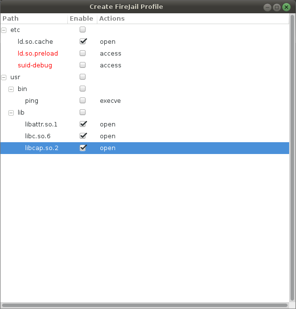

# GUI Helper to create FireJail Profiles

Introduction
============

This script is intended to help in the creation of [FireJail](https://github.com/netblue30/firejail) profiles.

With firejail it's possible to limit the access of a process (and his childrens) to some files in the filesystem. This process can be difficult and slow so this tool has been created to help with this.

Usage
=====

First you need to execute the application that you want to limit with firejail with strace:

    strace -e trace=file ping 2&> foo
    cat foo | grep "^\(access\|chmod\|execve\|getcwd\|lstat\|mkdir\|open\|readlink\|rename\|stat\|statfs\|symlink\|unlink\|utime\)(" | cut -d'"' -f1,2,3 | sort | uniq > bar
    python2 fireProfileHelper.py

Screenshots
===========

